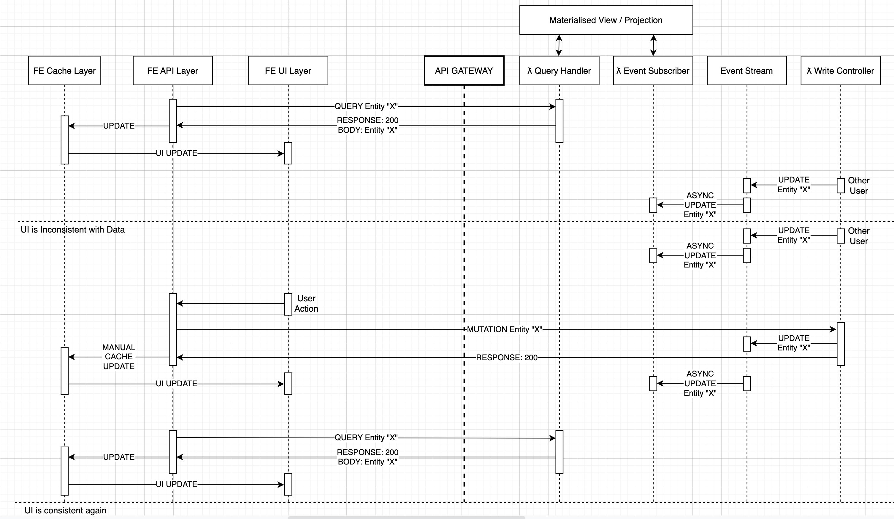

# Data Synchronisation: Current Problem

Currently, we effectively have no synchronisation. This is summarised by the 2 problem statements:

> "If another user updates an entity that I am viewing or working on, I am unaware of their change.
> This could lead to me overriding their changes, or making changes based on inaccurate information."

> "When I update an entity, I update my local state/data manually based solely on the knowledge that the write command succeeded, therefore I am no longer in sync with the reac model, there is no longer a single source of truth."

Below is a diagram to show what this looks like:

 

[Next - "Data Synchronisation: Possible Solutions" ->](../DataSynchronisation/2.PossibleSolutions.md)

[Home ->](/README.md)
