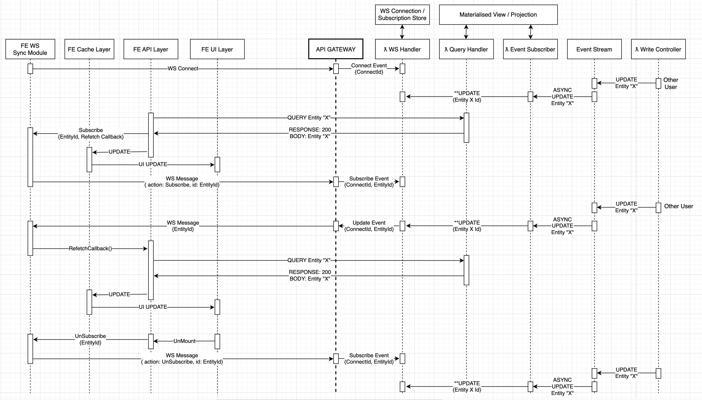
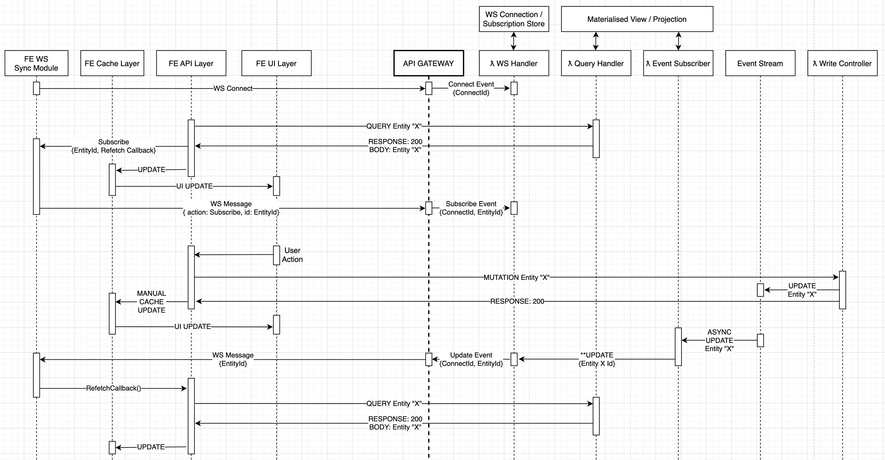

# Proposed Solution

**Disclaimer**: this solution is only to solve the eventual consistency issues, solution for remaining issues will be discussed later.

The solution will go something like this:

[Proposed Solution: Client Architecture](./2.ClientArchitecture.md)

[Proposed Solution: Server Architecture](./3.ServerArchitecture.md)

Here are some high level examples of what our new flow might look like.

 

[Next - "Proposed Solution: Client Architecture" ->](./2.ClientArchitecture.md)

[Home ->](/README.md)
